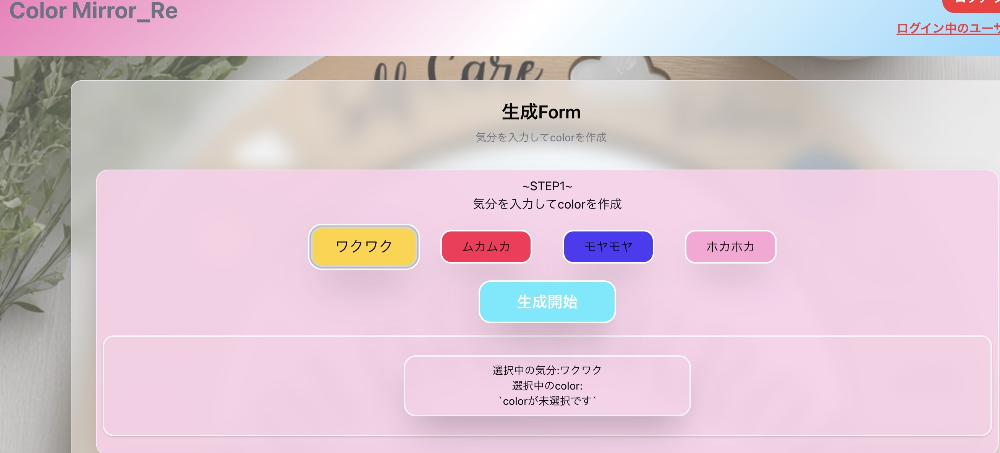
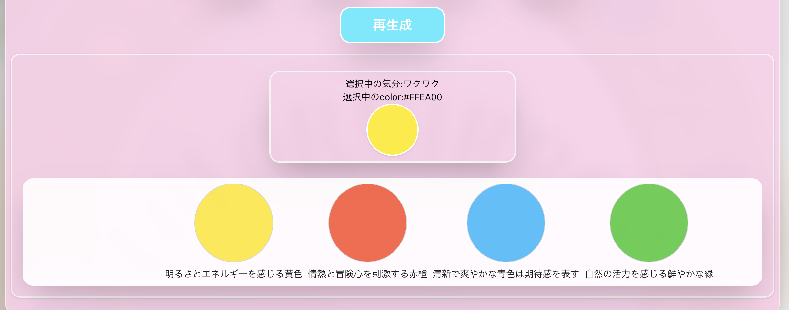
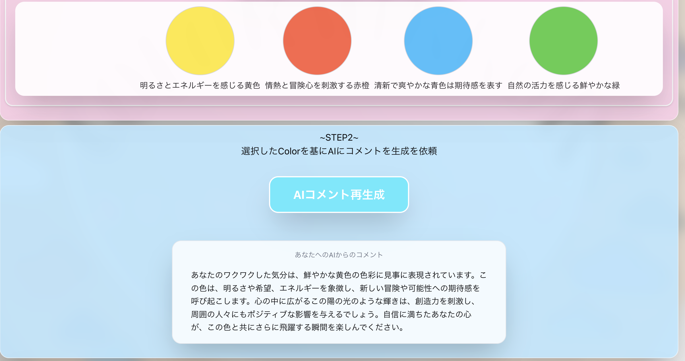
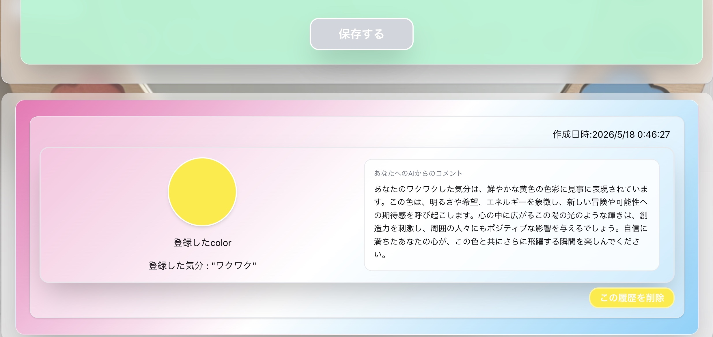
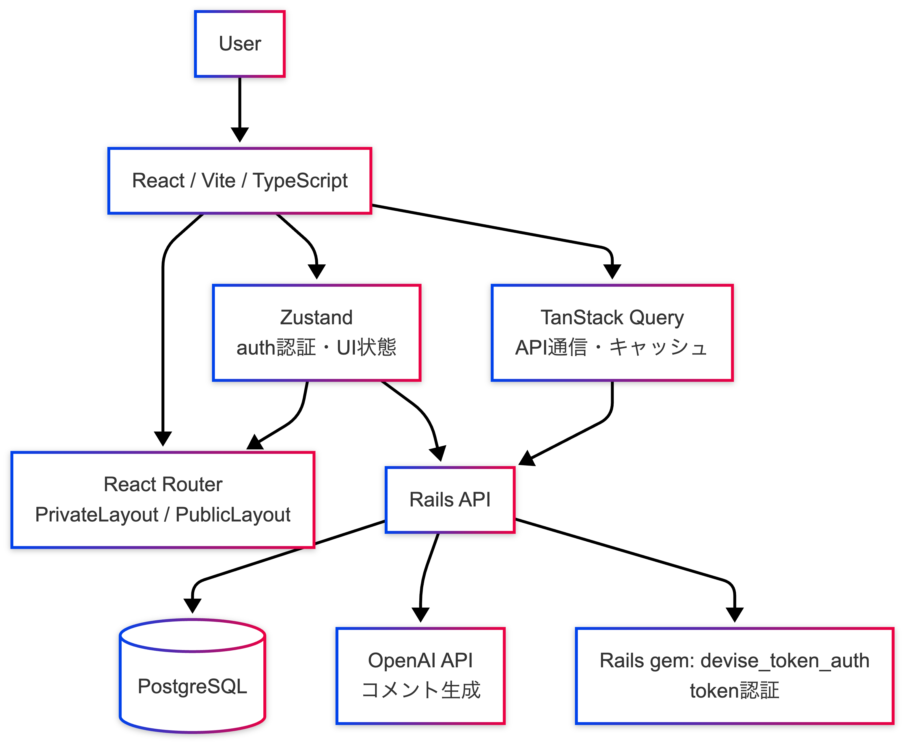
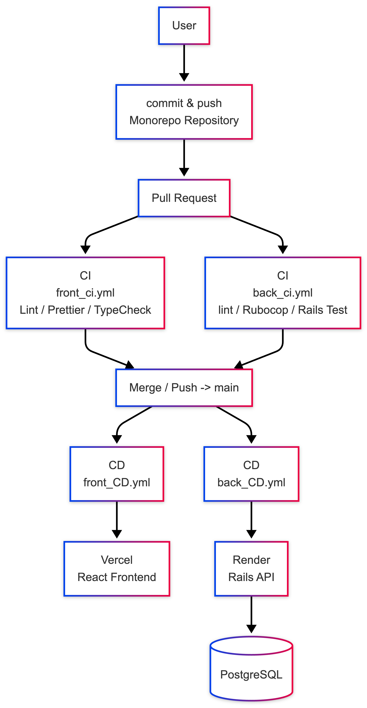

# ColorMirror_Re

## リプレイス元のリポジトリ

https://github.com/yuji-2293/ColorMirror


## 目次
- [リプレイス元のリポジトリ](#リプレイス元のリポジトリ)
- [目次](#目次)
- [アプリ URL](#アプリ-url)
- [アプリイメージ画像](#アプリイメージ画像)
- [アプリ使用スクリーンショット](#アプリ使用スクリーンショット)
- [アプリの基本処理フロー](#アプリの基本処理フロー)
- [アーキテクチャ図](#アーキテクチャ図)
- [CI/CDフロー図](#cicdフロー図)
- [CI/CD設計](#cicd設計)
- [テスト設計](#テスト設計)
- [リプレイス開発してみた所感](#リプレイス開発してみた所感)
- [開発背景](#開発背景)
- [機能選定](#機能選定)
- [技術スタック](#技術スタック)
- [設計意図(技術記事)](#設計意図技術記事)

## アプリ URL
url : https://color-mirror-re.vercel.app

---

### テストアカウントを用意しています
- 下記アドレス、パスワードを使ってログインすることができます。  

<p>
 メールアドレス : test999@gmail.com<br>

 パスワード: "testtest"
</p>

---

## アプリイメージ画像
<p>
  
</p>

## アプリ使用スクリーンショット
  ### 1. mood選択   
  自分の今現在の気分を選択します。
    

  ---

  ### 2. colorの生成/選択  
  選択した気分をもとに「生成開始」を押すとOpenAI APIへリクエストを投げ、気分に沿った4択のcolorを生成、さらに自分にあったcolorを選択します。→生成後のボタンは「再生成」に変わります。
  

  ---

  ### 3. AIコメントの生成   
  colorの選択後、「AI生成開始」ボタンを押すとOpenAI APIへリクエストを投げ、moodとcolorを基にコメントを生成します。→生成後のボタンは「AIコメントの再生成」に変わります。
    

  ---

  ### 4. 記録データの保存、履歴の表示   
  OpenAI APIへリクエストをし、コメントを生成後、「保存する」ボタンを押すと、Rails APIにリクエストを投げ、DBにデータが保存されます。さらに、ページ下部に保存したデータを一覧(/index)に追加して表示します。
  

  ---

## アプリの基本処理フロー
```
mood選択
↓
OpenAI APIによるcolor生成
↓
color選択
↓
OpenAI APIによるAIコメント生成
↓
Rails API経由で保存
↓
履歴一覧へ反映
```


## アーキテクチャ図
<p>
  
</p>

## CI/CDフロー図

<p>
  
</p>


## CI/CD設計

- Pull Request時はCIのみ実行

- mainブランチへのmerge後にCDを実行

- frontend / backend / E2E のworkflowを分離
  - モノレポ構成に合わせて、変更されたディレクトリ単位でworkflowを制御
    - frontディレクトリで変更があれば、front_ci.ymlが走る
    - backディレクトリで変更があれば、back_ci.ymlが走る
    - 両方のディレクトリに変更があれば、e2e.ymlが走る

- PaaS本来の自動デプロイはoffにし、デプロイはCIが通った時のみActions側のCDにより実行
  - frontはVercel、backはRenderへ個別デプロイ

---

## テスト設計

### フロントエンドでは、責務ごとに分けてVitest / React Testing Library/ Playwrightを使用して、テスト実装を行いました
Unit Test:
- API
- Hooks
- Components
- zustand(store)
- TanStack Query
- Validation
- Routing Guard
- 認証の復元処理

```
GitHub Actions実行結果
  テストファイル: ✅ **合格25件** · 合計25件
  テスト結果: ✅ **合格130件** · 合計130件
```

Playwright(E2Eテスト)
メイン機能のE2Eフロー:

```
mood選択
↓
color生成
↓
color選択
↓
AIコメント生成
↓
データ保存
↓
一覧画面への反映
```
E2EのCI環境構築を行い、PostgreSQL/Rails APIサーバー/Vite/Chromium/をGitHub Actions上で実行するようにしました  
実行環境: Chromium１本に絞り、実行パフォーマンスを上げてテストを実行しました  
外部API(OpenAI API)のみ、バックエンドのServiceクラスのMock化を行い、既定値のみ返却する形を取りました。  
これにより、本番環境に近い形でテストを実行できる環境を構築しました  

---

<details>
<summary>アプリの提供する価値(元のアプリより引用)</summary>

- その日の気分と相関する「色」を通じて、1日をポジティブに始められる記録アプリです。
- 登録した気分に対応した感情をもとにAIがパーソナライズコメントを生成します。
- コメントは“自分だけの手紙”として記録され、自己対話を促します。

</details>


## リプレイス開発してみた所感

- 元のアプリでは触れられなかった「責務単位」での開発をする経験ができた
  - RailsからUI更新、状態の管理を切り離してReactへ移行、front/backの責務を整理できた
  - 単純に便利だからライブラリを実装するのでなく、「責務」に対して必要なライブラリを選定することを考えながら実装を進めることができた

## 開発背景

  ### リプレイス開発で理解したかったこと
  ReactにおけるSPA構成でリプレイスすることで、以下の領域を理解することを目的としました。
  - Zustandによる認証状態管理  
  - TanStack QueryによるServer State管理  
  - API Clientの共通化  
  - TypeScriptによる型定義
  - GitHubActions による CI/CD制御
  - モノレポ構成によるSPA開発の全体像


> 今回、単純なリプレイス開発でなく、Rails側が持っていた責務をReactに移したらどのように分離、実装するのかを理解する開発にすることができました。
---


## 機能選定

### 認証機能
- devise_token_auth によるログイン認証
  - ログイン
  - ログアウト
  - 認証状態による画面制御

### 基幹機能
- 気分の選択
- 選択した気分を元にした color 生成
- 生成された color 候補から1色を選択
- 選択した color と mood を元に AIコメントを生成
- color と AIコメントを関連付けて保存
- 保存した履歴の一覧表示
- 履歴の削除

### UI/UX
- toast による操作結果通知
- loading 表示
- 生成 / 再生成 / 保存の状態制御
- 最低限のレスポンシブ対応

---


## 技術スタック

<p>

  

</p>

| 分類 | 技術 | 補足 |
|---|---|---|
| フロントエンド | React / Vite / TypeScript | SPA構成 |
| UI | Tailwind CSS / shadcn/ui | コンポーネント・UIライブラリ |
| 状態管理 | Zustand | 認証状態をグローバル状態管理 |
| サーバー状態管理 | TanStack Query | APIデータ取得・キャッシュ・一覧情報の再取得/ユーザー情報の再取得 |
| バックエンド | Ruby on Rails 8.x APIモード | APIサーバーとして運用 |
| 認証 | devise / devise_token_auth | トークンベース認証（フロント側でCookie管理・インターセプターによるヘッダー付与）|
| データベース | PostgreSQL | 本番 / 開発共通 |
| 外部API | OpenAI API | color生成・AIコメント生成に使用 |
| インフラ | Vercel / Render | 自動デプロイをoff CDによってのみデプロイ |
| CI/CD | GitHub Actions | フロント / バックのCI/CD制御 |

## 設計意図(技術記事)

### Zustandによる認証状態管理

https://qiita.com/yuji2534/items/bde82b7c5d87ffa72e9b

### TanStack Queryを採用してServer Stateを管理

https://qiita.com/yuji2534/items/125bdb711986a3b90efb

### React + Rails APIでのリプレイス開発を通して、責務設計の変化について

https://qiita.com/yuji2534/items/79d66ad99a1a015f8cf9
