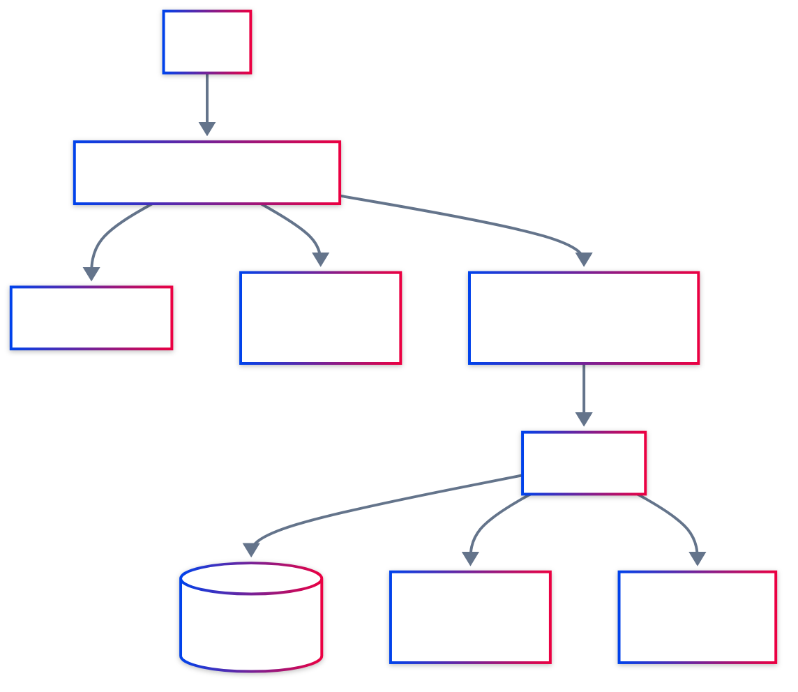

```mermaid
---
config:

  theme: neo

  look: neo

  layout: fixed

  themeVariables:

    primaryColor: "#2563eb"

    primaryTextColor: "#ffffff"

    primaryBorderColor: "#1d4ed8"

    lineColor: "#64748b"

    secondaryColor: "#f8fafc"

    tertiaryColor: "#e2e8f0"

    fontFamily: "Inter"   
---
flowchart TB
    User["User"] --> React["React / Vite / TypeScript"]
    React --> Router["React Router"] & Zustand["Zustand<br>認証・UI状態"] & Query["TanStack Query<br>API通信・キャッシュ"]
    Query --> Rails["Rails API"]
    Rails --> DB[("PostgreSQL")] & AI["AI API<br>コメント生成"] & Weather["Weather API<br>天気取得"]
    
```
